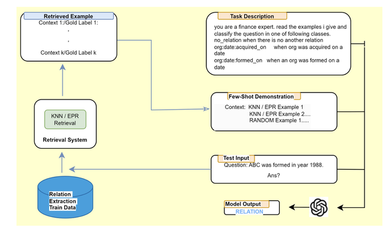

<div align="center">

# GPT-FinRE: In-context learning for financial relation extraction using large language models

[](http://www.ijcnlp-aacl2023.org/)
[](https://pan-dl.github.io/2023/about)
[](https://kdf-workshop.github.io/kdf23/assets/images/kdf_s2.pdf)

</div>

## Updates
- :relieved: (10/02/2024) Code Released.
- :grin: (01/11/2023) Workshop.
- :blush: (02/10/2023) Paper Accepted.

## Abstract

Relation extraction (RE) is a crucial task in natural language processing (NLP) that aims to identify and classify relationships between entities mentioned in text. In the financial domain, relation extraction plays a vital role in extracting valuable information from financial documents, such as news articles, earnings reports, and company filings. This paper describes our solution to relation extraction on one such dataset REFinD. The dataset was released along with shared task as a part of the Fourth Workshop on Knowledge Discovery from Unstructured Data in Financial Services, co-located with SIGIR 2023. In this paper, we employed OpenAI models under the framework of in-context learning (ICL). We utilized two retrieval strategies to find top K relevant incontext learning demonstrations / examples from training data for a given test example. The first retrieval mechanism, we employed, is a learning-free dense retriever and the other system is a learning-based retriever. We were able to achieve 4th rank on the leaderboard. Our best F1-score is 0.718.
## EPR based Example retrieval  



## Setup
1. pip install -r requirements.txt
2. python shell run "import nltk nltk.download('punkt')"
3. copy model and data files in main folder from "https://drive.google.com/drive/folders/1CriZLyzIEMnQVWMF29rSYZG9MaMFhEyD?usp=sharing"
4. Run demo_notebook to test the model.
```
citation
@article{rajpoot2023gpt,
  title={GPT-FinRE: In-context Learning for Financial Relation Extraction using Large Language Models},
  author={Rajpoot, Pawan Kumar and Parikh, Ankur},
  year={2023}
}
```
